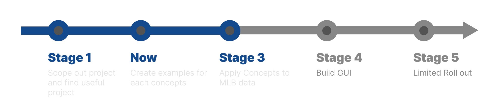

# Pitch Path Visiualization




The goal of this repo is to train a custom object-detection model to track a baseball pitch and calculate and display its trajectory.

This project has three main technical components:
1.	Baseball Detection — training a model to identify the baseball in each frame.
2.	Flight Estimation — calculating flight parameters from the detected positions.
3.	Trajectory Visualization — rendering the ball’s estimated path.

## Project Structure 
```
.
├── datasets/
│   └── ...                # Training and validation data
├── examples/              # Learning Examples (To showcase simple examples of each technical aspect) 
├── api/                   # Python backend (FastAPI/Flask), inference, endpoints 
│   └── ...  
├── web/                   # Next.js frontend (UI, visualizations) 
│   └── ...  
└── README.md              # Project documentation

```


## Datasets

Dataset are crucial to the performance of any good model.


We are using [YOLOv9 annotated Baseball data](https://github.com/BaseballCV/BaseballCV/tree/main/datasets/yolo) from 
[BaseballCV](https://github.com/BaseballCV/BaseballCV)

To download the dataset see [dataset.txt](dataset.txt)


## Inspiration
These are some Repo that have inspired this project. 


[ML-auto-baseball-pitching-overlay](https://github.com/chonyy/ML-auto-baseball-pitching-overlay)

[BaseballCV](https://github.com/BaseballCV/BaseballCV)

[⛳ Golf Ball Trajectory Visualization](https://github.com/jonibek95/GolfShotTracer)