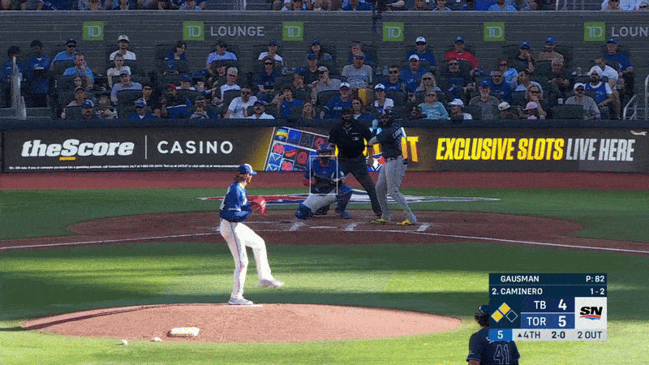

 # Examples

s## Getting started 

### Creating Conda Virutal Environment
```sh
conda create -n pitch-tracer python=3.10 -y
conda activate pitch-tracer
```
### Install Dipendencies (GPU Required)
```sh

```

## Baseball detection using YOLO Model


Basic Application of YOLOv11 on a single [pitch](/examples/media/baseball_pitch.mp4)

Using BaseballCV baseball dataset to fine-tune YOLOv11 models. 

### Attempt #1




- Issues:
    - Before ball leaves pitcher hand many false positives (to high of an error)

- Improvements
    - Train with more epoch 
    -  Use a more robust model (e.g. *yolo11n*) to train model


## 2D Least Squares 

Basic Least Squares fitting of porabola with reconstruction of trajectory animated 


We are approximating the function $y \sim x^2$ centered at $(0,0)$ . 


 