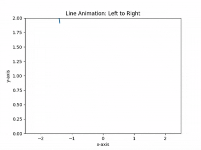

 # Examples

## Getting started 

### Creating Conda Virutal Environment
```sh
conda create -n baseballcv python=3.10 -y
conda activate baseballcv
```
### Install Dipendencies (GPU Required)
```sh
# Core dependencies
pip install numpy opencv-python torch torchvision torchaudio --index-url https://download.pytorch.org/whl/cu124

# Optional for visualization and notebook use
pip install matplotlib jupyter notebook tqdm

# If baseballcv is a local package (e.g., in the same folder):
pip install -e .
# Or if it's on PyPI:
pip install baseballcv

```

### From your terminal inside the environment:
```sh
jupyter notebook
```


## Baseball detection using YOLO Model

Basic Application of YOLO V9 on a single [pitch](./baseball-pitch.mp4)


Dependencies: 
- [baseballcv](https://baseballcv.com/)
 


## 2D Least Squares 

Basic Least Squares fitting of porabola with reconstruction of trajectory animated 



We are approximating the function $y \sim x^2$ centered at $(0,0)$ . 


 